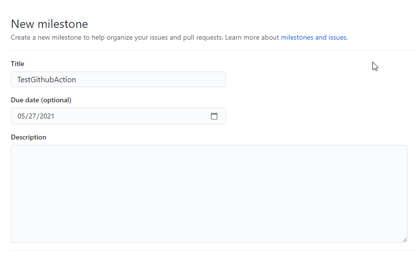
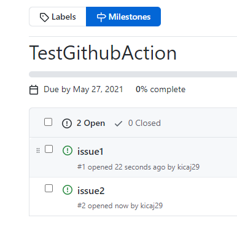
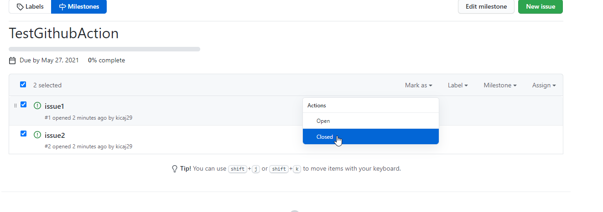
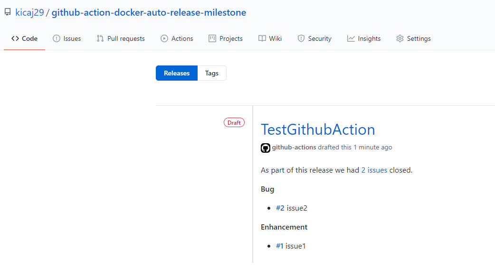

# Intro

Automatically draft release for a closed milestone.

# chmod
Before merging to the repo we have to make sure that `entrypoint.sh` is marked as executable.
On Windows open bash terminal and execute:

```
git add --chmod=+x -- entrypoint.sh
```
Next commit and push the change.

# Run action auto release milestone

* create a milestone in github


* create issues in the milestone


* close both issues


* in edit view close the milestone


Next the github workflow should generate draft release for the closed milestone:



# links
https://github.com/ecampidoglio/auto-release-milestone   


